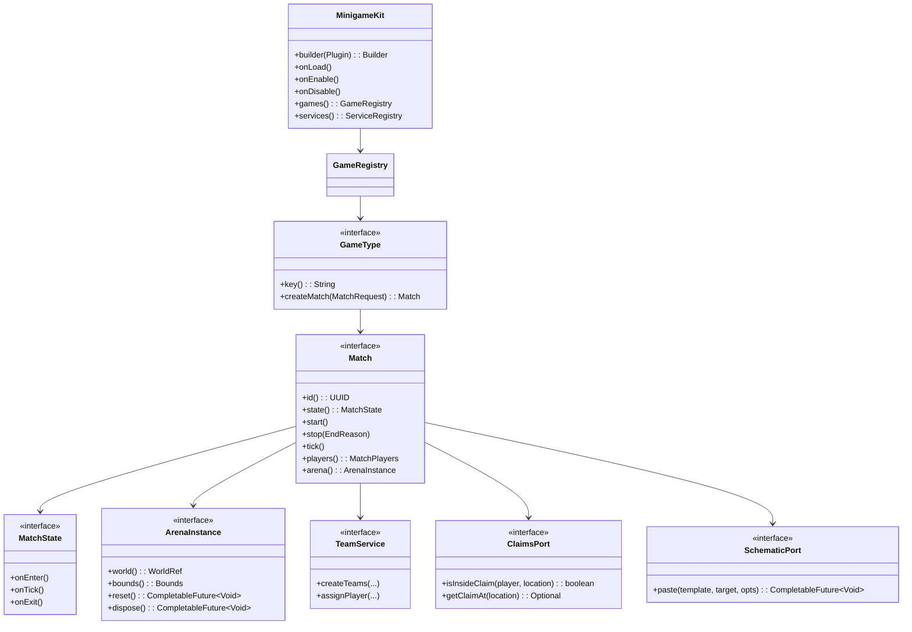

# Progettare una libreria Java modulare per minigame su Paper 1.21.8+

## Sintesi esecutiva

L’obiettivo realistico non è “fare un framework monolitico che sostituisce tutto”, ma costruire una **foundation embed‑first** (una libreria che viene inclusa/shadata dentro i plugin minigame) basata su un’architettura **Ports & Adapters (Hexagonal)**: il **core** definisce API stabili (porte) per match lifecycle, arena/instance, team, UI, persistence, ecc.; i **moduli adapter** collegano (quando presenti) i migliori componenti dell’ecosistema (comandi, GUI, scoreboard, schematics, claims, NPC, boss, packets, metrics). Questa impostazione riduce boilerplate senza legarti a un singolo vendor/stack, e ti permette di aggiornare Paper 1.21.8+ con rischio controllato (soprattutto dopo l’hard fork Paper). citeturn0search1

Per Paper “moderno” le scelte tecniche più vincolanti sono:
- **Java 21** come baseline per Paper 1.21.8+ (il Paper API richiede Java 21, in linea con vanilla). citeturn0search12  
- Uso esplicito di `paper-plugin.yml` (senza sostituire automaticamente `plugin.yml`) e gestione pulita di lifecycle e dipendenze. Paper consente di includere **entrambi** nello stesso JAR. citeturn7search3  
- Comunicazione/UX basate su **Adventure** e **MiniMessage**, inclusi e comuni nell’ecosistema Paper. citeturn5search0turn5search1  
- Un modello di concorrenza che **garantisca** che qualunque accesso a Bukkit/Paper API avvenga sul main thread: la stessa Javadoc del `BukkitScheduler` ribadisce che i task async non devono accedere alle API Bukkit. citeturn6search16  

Dal punto di vista licenze, la tua libreria deve restare **commercial‑friendly** (es. Apache‑2.0/MIT). Questo implica: adattatori verso plugin GPL/proprietari (WorldEdit/FAWE, ProtocolLib/PacketEvents, SlimeWorldManager, MythicMobs) devono essere **opzionali e late‑bound** (compileOnly + soft‑depend + reflection/ServiceLoader), evitando di distribuire codice coperto da licenze “contagiose” o redistribuzione non permessa. citeturn2search15turn3search14turn3search8turn4search5turn4search3  

Nota contesto: molte fonti e documentazioni tecniche chiave sono in inglese; in italiano la copertura è limitata (forum/thread si trovano, ma raramente sono “canonical”).  

## Visione e requisiti

**Assunzioni esplicite**
- Target: Paper 1.21.8+; Java 21 come toolchain/runtime. citeturn0search12  
- La libreria viene **inclusa** dai plugin minigame (shading o libraries loader), non è un “plugin‑piattaforma” unico per tutta la rete.
- Dove un componente esterno non dichiara esplicitamente 1.21.8, lo marchiamo “compatibilità non specificata” e lo incapsuliamo dietro un adapter isolato.

**Obiettivi principali (funzionali)**
- Gestione match end‑to‑end: lobby → countdown → running → ending → reset; timeouts; rejoin; cleanup deterministico.
- Astrarre e standardizzare: team/party; arena/istanze; kit/respawn; objective & win conditions; scheduling; persistence; comandi; GUI; scoreboard.
- Adapter per: claims (HuskClaims), schematic/reset (WorldEdit/FAWE), NPC (Citizens), boss (MythicMobs), packets (ProtocolLib/PacketEvents), metrics (bStats).
- Riduzione boilerplate tramite API “high-level”: registrazione game type, definizione fasi, hooking eventi, policy di arena, e servizi “batteries-included” (teleport safe, inventory snapshot, scoreboard session, ecc.).

**Requisiti non funzionali**
- **Compatibilità**: Paper 1.21.8+; supporto progressive per 1.21.x; attenzione alle divergenze Paper post hard fork. citeturn0search1  
- **Prestazioni**: evitare tick‑lag con reset mappe e scoreboard; supportare istanze parallele (più match contemporanei).
- **Thread-safety**: nessun accesso Bukkit API in async; async solo per I/O (DB/file/network). citeturn6search16  
- **Estendibilità**: API stabile, eventi, services sostituibili; adapter isolati.
- **DX**: template progetto, esempi minigame, generator per `paper-plugin.yml`, Javadocs e guide. citeturn5search3turn7search3  

## Architettura e modularità

**Principio guida: Core minimale + moduli e adapter opzionali**
- Il **core** non dipende da plugin esterni; definisce “porte” (`CommandPort`, `GuiPort`, `SchematicPort`, `ClaimsPort`, …).
- Gli **adapter** implementano queste porte se (e solo se) il componente esterno è presente e compatibile.

### Diagramma dipendenze consigliato

```mermaid
graph TD
  A[minigamekit-core] --> B[minigamekit-paper]
  A --> C[minigamekit-match]
  A --> D[minigamekit-arena]
  A --> E[minigamekit-teams]
  A --> F[minigamekit-i18n]
  A --> G[minigamekit-persistence]
  A --> H[minigamekit-security]

  B --> I[minigamekit-adapter-commands-commandapi]
  B --> J[minigamekit-adapter-commands-cloud]
  B --> K[minigamekit-adapter-gui-invui]
  B --> L[minigamekit-adapter-gui-inventoryframework]
  B --> M[minigamekit-adapter-scoreboard-fastboard]
  B --> N[minigamekit-adapter-claims-huskclaims]
  B --> O[minigamekit-adapter-schematics-worldedit]
  B --> P[minigamekit-adapter-schematics-fawe]
  B --> Q[minigamekit-adapter-world-swm]
  B --> R[minigamekit-adapter-npc-citizens]
  B --> S[minigamekit-adapter-boss-mythicmobs]
  B --> T[minigamekit-adapter-packets-protocollib]
  B --> U[minigamekit-adapter-packets-packetevents]
  B --> V[minigamekit-adapter-metrics-bstats]
```



**Nota su `paper-plugin.yml` e mapping**  
Paper tratta `paper-plugin.yml` in modo distinto e consente di includere anche `plugin.yml` nello stesso jar: è utile per compatibilità e per configurazioni Paper-specific. citeturn7search3  
Alcune librerie GUI (es. InvUI) evidenziano che, con Paper “Mojang‑mapped runtime”, alcune dipendenze (inventory‑access) vanno caricate tramite il **library loader** di Paper per essere remappate correttamente quando si usa `paper-plugin.yml`. citeturn7search12  

### Modello di runtime

- **ServiceRegistry**: un contenitore leggero (no DI pesante) che espone i servizi core e i port risolti dagli adapter.
- **MatchRuntime**: ogni match ha un lifecycle gestito da una state machine (interna o integrata), e possiede/gestisce risorse: roster team, arena instance, scoreboard session, task handles, persistence scope.
- **Event routing**: un singolo listener Paper per categoria (join/quit/combat/block/inventory/move) delega al match attivo via `MatchRouter` (riduce boilerplate e migliora debug).
- **Policy layer**: regole (build allowed, PvP allowed, interact allowed, outside-boundary, anti‑cheat) come oggetti composabili.

## API pubblica e lifecycle

### Oggetti e relazioni principali (ER/Domain)



### Lifecycle consigliato

- `onLoad()` (plugin): inizializza configurazione minima, registry, e adapter che richiedono hook precoci (es. CommandAPI, se shadata e richiesta). citeturn10search4  
- `onEnable()` (plugin): registra listener/router, registra game types, carica arena templates, abilita metrics, avvia scheduler tick.
- `onDisable()` (plugin): stop match attivi, flush persistence, cleanup scoreboard/task.  

Paper fornisce una guida al scheduling (non-Folia) e distingue l’uso dei scheduler Folia quando si è su quella piattaforma. La tua libreria dovrebbe avere un layer `SchedulerPort` per poter restare Paper-first ma non “ostile” a Folia. citeturn6search0turn6search3  

### API “high-level” orientata al minimo boilerplate

Proposta: un DSL/builder “composizionale”:

```java
public final class BossesVsPlayersPlugin extends JavaPlugin {
  private MinigameKit kit;

  @Override
  public void onLoad() {
    kit = MinigameKit.builder(this)
      .platform(PaperPlatform.create())
      .install(MinigameModules.matchEngine())
      .install(MinigameModules.arena())
      .install(MinigameModules.teams())
      .install(MinigameModules.persistenceYaml())   // default semplice
      .install(MinigameModules.i18nMiniMessage())   // Adventure/MiniMessage
      .install(MinigameAdapters.commandsCommandApi(cfg -> cfg.silentLogs(true)))
      .install(MinigameAdapters.guiInvUi())
      .install(MinigameAdapters.scoreboardFastBoard())
      .install(MinigameAdapters.claimsHuskClaims())
      .install(MinigameAdapters.bossMythicMobsOptional())
      .install(MinigameAdapters.metricsBStats( /* pluginId */ 12345 ))
      .build();

    kit.onLoad();
  }

  @Override
  public void onEnable() {
    kit.onEnable();
    kit.games().register(new BossesVsPlayersGameType());
  }

  @Override
  public void onDisable() {
    kit.onDisable();
  }
}
```

Motivazioni con fonti:
- CommandAPI richiede chiamate di inizializzazione in `onLoad()` e `onEnable()` quando integrata/shadata; l’adapter dovrebbe incapsularle. citeturn10search4  
- Paper include Adventure ed è comune usare componenti net.kyori; MiniMessage ha documentazione ufficiale Paper e un’API chiara. citeturn5search0turn5search13  

## Adapters e integrazioni

### Tabella comparativa moduli core e adapter

Legenda: compatibilità = dichiarata in modo credibile per 1.21.8+ o per 1.21.x; “non specificata” = assenza di dichiarazione esplicita.

| Modulo/Adapter | Ruolo nella libreria | Dipendenza runtime | Licenza esterna (rilevante) | Compat 1.21.8+ | Rischi principali | Facilità integrazione |
|---|---|---|---|---|---|---|
| Core + Paper platform | lifecycle, routing eventi, scheduler, base services | Paper | — | Sì (target) | churn Paper post hard fork | Alta |
| i18n MiniMessage | messaggi/locale via Adventure | Paper Adventure | MIT (Adventure/MiniMessage) | Sì | gestione chiavi/placeholder | Alta citeturn5search1turn5search21 |
| Commands: CommandAPI | comandi type-safe + UI brigadier | lib (shading o libraries) | OSS (moduli Paper dedicati) | Sì fino a 1.21.11 | init early, refactoring moduli | Alta citeturn1search2turn10search4 |
| Commands: Cloud | comandi modulare Paper-first | lib | MIT | Sì | API beta 2.x, integrazione Brigadier | Media citeturn1search3turn1search7 |
| GUI: InvUI | menu inventory avanzati | lib | (non mostrata qui; assumere OSS) | dichiarata fino a 1.21.11 | mapping Paper + library loader | Media citeturn2search0turn7search12 |
| GUI: inventory-framework | alternative GUI API | lib | MIT | plausibile (release attive) | surface API ampia: scegliere subset | Media citeturn2search1turn2search9 |
| Scoreboard: FastBoard | scoreboard packet-based | lib | MIT | dichiarata fino a 1.21.11 | aggiornamenti frequenti linee | Alta citeturn2search2turn10search2 |
| Claims: HuskClaims | regions/claim come arena e restrizioni | plugin HuskClaims | Apache-2.0 | range 1.17–1.21 | versioning API e server cross‑sync | Alta citeturn9search0turn8search3 |
| Schematics: WorldEdit | paste/reset arena | plugin WorldEdit | GPLv3 | esplicita 1.21.8 | licenza + performance paste | Media citeturn2search15turn2search11 |
| Schematics: FAWE | paste più veloce/async | plugin FAWE | GPL‑3.0-only | supporto fino a 1.21.8 | licenza, differenze API | Media citeturn3search14 |
| World instancing: SWM | istanze mondo/reset rapido | plugin SWM | GPL‑3.0 | non specificata qui per 1.21.8 | lock-in formato SRF | Media citeturn3search1 |
| NPC: Citizens | NPC service | plugin Citizens | OSL‑3.0 (copyleft) | non specificata qui per 1.21.8 | dipendenza forte da Citizens | Alta citeturn8search1turn9search1 |
| Boss: MythicMobs | boss scripting, skills | plugin MythicMobs | proprietaria | file dichiara 1.21.8 | differenze free vs paid | Media citeturn4search3turn4search7 |
| Packets: ProtocolLib | packet hooks | plugin ProtocolLib | GPL‑2.0 | versioni fino a 1.21.8 | licenza, mapping packet | Media citeturn3search5turn3search8 |
| Packets: PacketEvents | packet wrappers | plugin PacketEvents | (spesso GPL) | update supporto 1.21.8 | problemi con relocation | Media/Bassa citeturn4search5turn4search1 |
| Metrics: bStats | telemetry | lib (shading) | OSS | Sì | privacy/opt-out, relocation | Alta citeturn4search2turn4search14 |
| Host interop: Foundation | integration “nice to have” | lib (evitare transitive) | **licenza custom** | dipende dalla versione | vincoli commerciali/attribuzione | Bassa citeturn4search8turn4search0 |
| Host interop: TabooLib | interop i18n/metrics/script | lib | MIT | “major 1.21” | docs e API multi-modulo | Media citeturn8search5turn1search9 |

### Concorrenza e scheduling negli adapter

Regola: qualunque adapter che tocca Bukkit/Paper (teleport, world edit, inventory, entity) deve eseguire in **sync** o con scheduler compatibile. La Javadoc di `BukkitScheduler` esplicita che i task asincroni non devono accedere alle API Bukkit. citeturn6search16  
Per componenti che promettono “async” (es. FAWE), il tuo port deve comunque trattarlo come “eventualmente asincrono” ma sempre con callback finale sul main thread per lo stato match. citeturn3search14  

### Snippet minimi per adapter

L’idea è che **registrazione game type e lifecycle** siano sempre uguali; cambia solo quali adapter installi.

#### Adapter comandi: CommandAPI

CommandAPI richiede init in `onLoad()` + `onEnable()`; l’adapter deve farlo automaticamente o validare che sia stato fatto. citeturn10search4  

```java
// minimo: installa adapter e dichiara che vuoi CommandAPI come backend comandi
kit = MinigameKit.builder(this)
  .install(MinigameAdapters.commandsCommandApi(cfg -> cfg.silentLogs(true)))
  .build();
```

#### Adapter GUI: InvUI

InvUI dichiara supporto 1.14–1.21.11; su Paper con `paper-plugin.yml` segnala la necessità di caricare `inventory-access` tramite library loader per remapping. citeturn2search0turn7search12  

```java
kit = MinigameKit.builder(this)
  .install(MinigameAdapters.guiInvUi())
  .build();
```

#### Adapter scoreboard: FastBoard

FastBoard mostra un uso estremamente semplice (creazione board, update title e lines). L’adapter dovrebbe gestire: creazione su join match, update cadenzati (es. ogni 10 tick), destroy su exit. citeturn10search2turn2search2  

```java
kit = MinigameKit.builder(this)
  .install(MinigameAdapters.scoreboardFastBoard())
  .build();
```

Per completezza, la libreria dovrebbe esporre un port scoreboard “high-level” come `ScoreboardSession` e l’adapter lo implementa con `FastBoard`.

## Dipendenze, shading e vincoli di licenza

### Scelta licenza per la tua libreria

Consiglio: **Apache‑2.0** (o MIT) per massima compatibilità commerciale e adozione. (Apache‑2.0 è già usata da HuskClaims ed è comune in ecosistemi plugin.) citeturn9search0  

### Strategie di packaging

**Strategia A: “shade controllato” (raccomandata per DX)**
- Il plugin minigame shada `minigamekit-*` e alcune librerie permissive (MIT/Apache) dentro il proprio jar.
- Usa relocation per evitare conflitti (es. bStats consiglia espressamente shade + relocate). citeturn4search2  

**Strategia B: Paper library loader (`libraries`)**
- Evita jar enormi e riduce conflitti, ma richiede rigore su mapping e risoluzione dipendenze.
- `paper-plugin.yml` non è drop‑in e Paper consente coesistenza con `plugin.yml`. citeturn7search3  
- Alcuni tool generano `paper-plugin.yml` automaticamente; `plugin-yml` di Minecrell genera anche `paper-plugin.yml` tramite DSL (repo archiviato, ma utilizzabile). citeturn5search3turn7search5  

### Moduli “GPL/proprietari”: come non contaminare il core

Per WorldEdit (GPLv3) e FAWE (GPL‑3.0-only), mantieni adapter in un modulo separato:
- dipendenza `compileOnly` sull’API;
- runtime: plugin esterno installato sul server;
- fallback: implementazione “no-op” o reset “manuale” se assente. WorldEdit dichiara build Bukkit compatibili con 1.21.8. citeturn2search15  
FAWE dichiara supporto fino a 1.21.8 in una versione specifica. citeturn3search14  

Per ProtocolLib (GPL‑2.0) e PacketEvents:
- ProtocolLib dichiara versioni fino a 1.21.8 su Hangar e release con supporto 1.21.4–1.21.8. citeturn3search5turn3search19  
- PacketEvents dichiara update con supporto 1.21.8, ma esiste un issue specifico su Paper 1.21.8 quando PacketEvents è **relocata** (NoClassDef durante login). Questo rende l’adapter “fragile” se il tuo plugin shada/reloca PacketEvents: meglio dipendere dal plugin esterno e non relocalizzare, o testare severamente. citeturn4search5turn4search1  

Per SlimeWorldManager (GPL‑3.0) e SRF:
- il repo descrive SRF e l’origine Hypixel; è utile, ma crea lock‑in sul formato. citeturn3search1  
Qui l’astrazione deve essere: `WorldInstanceProvider` con più backend, non “SWM ovunque”.

Per MythicMobs (proprietario):
- il file 5.10.0 dichiara supporto 1.21.8 su CurseForge; tuttavia feedback community segnala incompatibilità per la free version su 1.21.8 in certi casi/versioni. Il tuo adapter deve trattare MythicMobs come **optional** e degradare elegantemente. citeturn4search3turn4search7  

### Nota critica su Foundation

Se vuoi “interop” con Foundation, non includerla come transitive dependency nel tuo core: la licenza è **non standard** e impone condizioni diverse tra repository e contesti (uso commerciale legato allo status di “paying student”, obblighi di attribuzione, o addirittura non-commercial in alcune varianti). Questo è un rischio di distribuzione per una libreria riusabile. citeturn4search8turn4search0  
Se proprio serve, fai un adapter separato, senza dipendenze transitive, che si attiva solo se l’applicazione host la usa già.

## Testing, CI/CD, roadmap e matrice compatibilità

### Strategia di test

**Unit test (JVM)**
- Testare match engine, state transitions, team logic, win conditions, persistence serialization, i18n rendering/placeholder.
- Mock dei port (es. `SchematicPort` fake) e test deterministici.

**Test “plugin-like” con MockBukkit**
- MockBukkit è un framework per unit‑testing di plugin Bukkit/Paper e raccomanda JUnit per il runner; esistono artefatti anche per “v1.21”. citeturn5search2turn5search6turn5search18  

**Integration test su server reale**
- Avvia Paper in CI (docker o runner) e carica un plugin “test harness” che esercita: join/quit, teleports, paste schematic, scoreboard updates, claims checks.
- Per adapter basati su plugin esterni (WorldEdit, HuskClaims, Citizens, ProtocolLib), includi i jar in una matrice separata e verifica handshake + smoke tests.

### CI/CD e release plan

- **Repository** su entity["company","GitHub","code hosting"] con GitHub Actions (build, test, publish).
- Pubblicazione su entity["company","Sonatype","maven central operator"] / Maven Central con coordinate tipo:
  - `io.patric.minigamekit:minigamekit-bom`
  - `io.patric.minigamekit:minigamekit-core`
  - `io.patric.minigamekit:minigamekit-paper`
  - `io.patric.minigamekit:minigamekit-adapter-*`
- **Semantic Versioning**:  
  - MAJOR: breaking API pubblica core (`GameType`, `Match`, ports)  
  - MINOR: nuovi servizi/moduli, nuovi adapter  
  - PATCH: bugfix e compatibilità minori  
- **Compatibility policy**: “N‑2 minor” su Paper (es. supporta 1.21.8, 1.21.9, 1.21.10/1.21.11 finché Javadoc e breaking change non lo impediscono), con note esplicite su Paper post hard fork. citeturn0search1  

### Roadmap implementativa (milestone + effort)

| Milestone | Contenuto | Effort | Output verificabile |
|---|---|---|---|
| Core runtime | lifecycle, ServiceRegistry, MatchRouter, scheduler abstraction | Medium | plugin demo “hello match” + Javadocs base |
| Match engine | state machine, timers, phases, end reasons, cleanup | Medium | 2 giochi demo (duel + FFA) |
| Arena + reset | ArenaInstance, template registry, reset strategies (basic, schematic port) | Large | benchmark reset + harness arena |
| Team/party | team assignment, friendly fire policy, roster sync, spectators | Medium | test suite win conditions |
| Persistence | YAML + SQL port, migrations, repositories | Large | demo stats + schema versioning |
| UI/Commands/Scoreboard | ports + adapter (CommandAPI/Cloud, InvUI/InvFramework, FastBoard) | Large | menu join/queue + scoreboard runtime |
| Integrazioni “hard” | HuskClaims, WorldEdit/FAWE, Citizens, packets, metrics | Large | demo “wars claim” + “boss arena” |
| DX & docs | template, cookbook, docs site, publish stable | Medium | starter repo + guide italiana dove possibile |

### Testing matrix consigliata

| Dimensione | Casi minimi |
|---|---|
| Versioni Paper | 1.21.8 (baseline), + ultima 1.21.x disponibile nel tuo range |
| Java | 21 |
| Modalità match | single‑match, multi‑match paralleli, rejoin |
| Reset arena | no reset, schematic (WorldEdit), schematic (FAWE), istanza mondo (SWM) |
| Claims | con e senza HuskClaims installato; claim boundary edge cases |
| NPC/Boss | con e senza Citizens / MythicMobs |
| Packets | senza packets; con ProtocolLib; con PacketEvents (senza relocation) |
| Carico | 20/50/100 player bot (se possibile) e misure tick/latency |

## Raccomandazioni per giochi target e note di migrazione Paper/Java

### Set moduli consigliati per gioco

**Wars (team battles tra due claims HuskClaims)**
- Core + Match engine + Teams + Security
- Adapter HuskClaims (arena = claim, policy build/pvp/interact) citeturn8search3turn9search0  
- Commands (CommandAPI o Cloud) citeturn10search4turn1search3  
- Scoreboard (FastBoard) per timer/score citeturn2search2  
Tradeoff: la “fisica” del territorio (chunk load, border handling) va modellata nel core come policy, non sparsa in listener.

**Pillar Peril (hazards + reset frequente)**
- Core + Match engine + Arena
- SchematicPort con WorldEdit/FAWE (preferibile FAWE se installato per performance; fallback WorldEdit) citeturn3search14turn2search15  
- GUI per vote/join (InvUI o inventory-framework) citeturn2search0turn2search1  
Tradeoff licenza: WorldEdit/FAWE sono GPL; tenerli come plugin esterni riduce rischi di distribuzione.

**Build Battle**
- Match engine con fasi chiare (build → vote → results) e scheduling robusto
- Arena reset con schematic o istanze mondo se vuoi “zero residui”
- i18n + scoreboards  
InvUI ha esempi/concetti per window/GUI builder; il tuo port deve astrarre la “GUI session” e non imporre la lib sottostante. citeturn10search9turn10search5  

**Bosses vs Players**
- BossPort con MythicMobs opzionale: se presente, “low‑code”; se assente, fallback a boss “vanilla” gestito dal core. citeturn4search3turn4search7  
- Packets solo se necessari: ProtocolLib è spesso più stabile per “minor updates” e dichiara supporto fino a 1.21.8; PacketEvents richiede cautela su relocation. citeturn3search5turn4search1  

### Migrazione e compatibilità Paper 1.21.8+

- **Java 21**: Paper API lo richiede; la libreria deve compilare e testare su 21. citeturn0search12  
- `paper-plugin.yml`: non è un rimpiazzo automatico di `plugin.yml`; puoi includere entrambi nello stesso jar. Questo facilita compatibilità e riduce sorprese quando usi caratteristiche Paper‑specific. citeturn7search3  
- **Post hard‑fork**: riduci dipendenze su comportamenti non documentati; privilegia API pubbliche e incapsula ogni NMS/packet hack dietro port ben testati. citeturn0search1  
- Messaggistica: Paper include Adventure; MiniMessage ha doc e API ufficiali Paper (scelta ideale per i18n + component rendering). citeturn5search0turn5search13  
- Config: Paper documenta YAML come formato nativo; JSON/TOML richiedono librerie extra (da gestire come optional/shaded). citeturn7search19  

### Benchmark e misure da eseguire

- **Reset arena**: tempo medio e p95 per reset schematic (WorldEdit vs FAWE) e per reset istanza (SWM) su mappe piccole/medie/grandi.
- **Scoreboard**: costo aggiornamento per player (linee 5/10/15) a diverse frequenze (1s, 0.5s, 0.1s).
- **Router eventi**: overhead per eventi frequenti (move, damage) con policy attive (claim bounds, anti‑cheat).
- **Persistence**: throughput write/read (stats, match results) con batch e flush su end match.

### Hook di sicurezza / anti-cheat

Paper include configurazioni world-level con sezione anticheat/anti‑xray, ma per minigame la parte importante è avere hook applicativi:
- `ValidationHook` su movement (speed, fly, outside bounds), combat (reach, rate-limit), block/place (region rules).
- integrazione “best effort” con plugin anti‑cheat esterni: non hard‑depend, ma esporre eventi e “deny reasons” per audit.

---

**Nota finale di design**: per mantenere la libreria stabile, tutto ciò che è “volatile” (packets, plugin proprietari, GPL, mapping Paper) deve vivere in adapter separati e sostituibili. Il core deve restare piccolo, ben testato, e con policy chiare su threading (main thread per API Bukkit), coerenti con le avvertenze ufficiali del scheduler. citeturn6search16