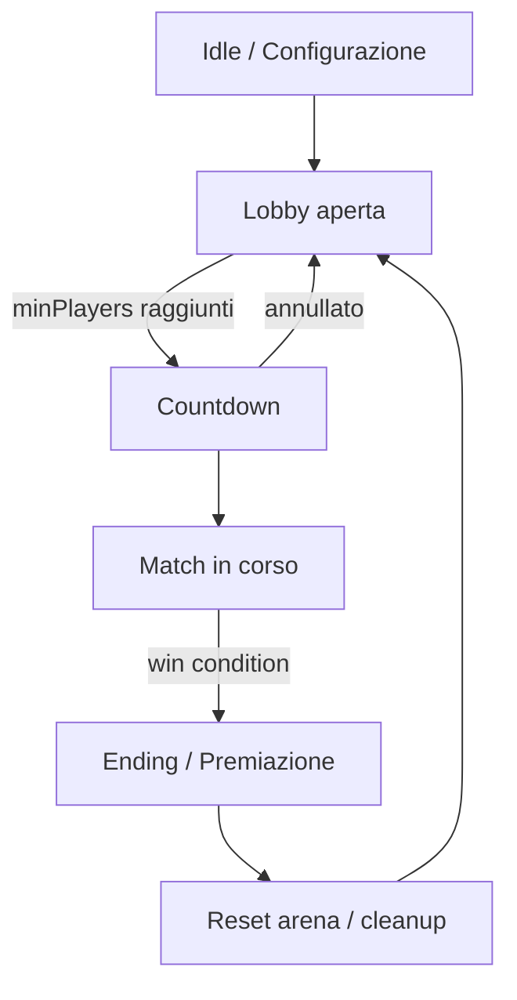

# Librerie e framework Java per minigame su Paper 1.21.8+

## Sintesi esecutiva

Il panorama “minigame framework” davvero completo e **attivamente mantenuto** per Paper moderno è sorprendentemente frammentato: esistono alcuni framework orientati ai minigame, ma molti sono **archiviati**, **fermi da anni**, o con **licenze copyleft (GPL/LGPL)** che possono diventare un problema se vuoi distribuire un plugin commerciale chiuso. citeturn29view2turn18view2turn18view0turn30search14

Per minimizzare boilerplate e “offloadare” il più possibile la gestione comune (lobby → countdown → match → end → reset), la strategia più robusta oggi è **combinare**:

- un **framework di sviluppo plugin** per ridurre boilerplate (config, comandi, menu, wrapper, lifecycle),  
- una **libreria di state machine** (o un engine match) per modellare le fasi di gioco,  
- librerie “verticali” per GUI, scoreboard, world edit/reset, persistence, e integrazioni (claims, NPC, boss, packets).

In pratica, per Paper 1.21.8+ (Java 21), il “sweet spot” per velocità di sviluppo e manutenzione tende a essere:
- **Foundation + FSMgasm + (CommandAPI o Cloud) + (InvUI o Inventory Framework) + FastBoard + (WorldEdit/FAWE) + (SlimeWorldManager se fai instancing)**. citeturn20view0turn21view0turn14search0turn14search1turn14search3turn27search1turn17search0turn15search0turn30search14turn15search13  
- alternativa “all‑in‑one modulare”: **TabooLib** (molti moduli pronti: UI, i18n, database/ORM, metrics, scripting Kether…), con trade‑off su ecosistema/documentazione (prevalentemente cinese) e impostazione Kotlin‑first ma usabile anche in progetti JVM misti. citeturn13search0turn13search8turn13search11  
- engine minigame “host/plugin”: **MinigameAPI**, **CraftContainers**, **MiniGameWorld**… utili se vuoi un runtime che gestisca istanze/arena in modo più “batteries included”, ma con trade‑off forti su manutenzione/compatibilità o licenza. citeturn29view2turn29view0turn29view1  

Per i tuoi giochi:
- **Wars tra HuskClaims**: la parte “arena/region” è quasi tutta dentro HuskClaims → la chiave è uno **stato match** pulito + team/roster + restrizioni eventi. citeturn9search0turn9search4turn9search1  
- **Pillar Peril / Build Battle**: serve reset veloce mappe/plot (schematic/clipboard/world duplication) → WorldEdit/FAWE e/o SlimeWorldManager. citeturn15search0turn30search14turn15search13  
- **Bosses vs Players**: se vuoi offloadare “boss scripting”, MythicMobs è spesso la scelta pragmatica (anche se commerciale/closed e con differenze tra free e paid in compatibilità percepita). citeturn22search37turn22search9  

## Vincoli di base

### Compatibilità Paper e Java per 1.21.8+

Paper/MC moderni richiedono **Java 21**: già da Minecraft 1.20.6 è indicato come requisito (Java 17 non basta) e nei log di Paper 1.21.8 si vede l’esecuzione con Java 21. citeturn9search2turn9search28turn16search10  
Assumere quindi **toolchain Java 21** (compile e runtime) è la scelta più “non sorprendente” per Paper 1.21.8+. citeturn9search28

### Paper vs Spigot e rischio divergenza API

Dal 1.21.4 Paper ha annunciato l’**hard fork** (non più vincolato alle scelte future di Spigot), mantenendo compatibilità iniziale ma aprendo la porta a divergenze graduali nel tempo. Questo impatta soprattutto librerie che “vivono” vicino ai dettagli d’implementazione o che si basano su comportamenti Spigot specifici. citeturn9search10turn19search9

### Descriptor moderno: paper-plugin.yml

Se vuoi usare funzionalità Paper‑specific (e avere un manifesto più moderno), Paper supporta `paper-plugin.yml` e consente anche di includere **sia** `plugin.yml` **sia** `paper-plugin.yml` nello stesso JAR. citeturn27search11

### Cambi API Paper rilevanti per minigame

Alcune modifiche Paper post‑1.21.8 possono diventare “mine antiuomo” se il tuo target è “1.21.8+” (quindi includi 1.21.9/1.21.10/1.21.11 ecc.). Ad esempio, Paper segnala cambi “breaking” sulla semantica di teletrasporto entità/veicoli. citeturn9search5  
Inoltre Paper sta deprecando API storiche non compatibili con messaggi component‑based (es. Conversation API), spingendo verso alternative moderne. citeturn9search24  

## Panoramica comparativa delle opzioni

Nella tabella seguente, “Compatibilità 1.21.8+” significa: dichiarata esplicitamente (o deducibile da range che include 1.21.8) e con manutenzione credibile. Se non esplicito, la voce è “non specificato” o “probabile ma non garantito”.

| Progetto | Categoria | Compatibilità Paper 1.21.8+ | Funzionalità chiave per minigame | Licenza / note commerciali | Attività / manutenzione (segnali) | Esempi / riferimenti |
|---|---|---|---|---|---|---|
| entity["organization","PaperMC","minecraft server project"] | Piattaforma server | Target | API plugin, performance, Paper‑specific features | OSS | Attivo; news e API in evoluzione | Javadoc Paper API citeturn9search18; guida `paper-plugin.yml` citeturn27search11 |
| entity["organization","MineAcademy Foundation","minecraft plugin library"] | Framework dev (boilerplate killer) | Dichiarato “1.21.x” + supporto Bukkit/Spigot/Paper/Folia | GUI API, comandi “advanced”, config auto‑update con commenti, wrapper DB/packets/hook, multi-version wrappers | **Licenza custom**: uso commerciale consentito ma con vincoli (attribuzione se non “paying student”, divieto rivendita parti) | Release recente (6.9.23 al 30 Jan 2026) + repo molto attivo | README + QuickStart + shading note citeturn20view0 |
| entity["organization","TabooLib","minecraft plugin framework"] | Framework dev “modulare” | “Major 1.21” e moduli multi‑platform | Moduli: UI (BukkitUI), i18n, DB/ORM, metrics, scripting (Kether), NMS helpers, ecc. | MIT | Aggiornato Feb/Mar 2026; docs ufficiali segnalate lente/discordanti | Moduli (indice) citeturn13search0; README citeturn13search8 |
| entity["organization","Fairy Framework","di framework for plugins"] | Framework dev (DI stile Spring) | Spigot resource: “native 1.21”, test fino a 1.21 | Dependency Injection, pattern CRUD, “write once run many platforms” | MIT | Repo aggiornato Feb 2026; community più piccola | README e progetti pubblici citeturn8view2; resource Spigot citeturn7search8 |
| entity["organization","MinigameAPI","minecraft minigame library"] | Minigame engine (lobby/arena) | Dichiarato 1.13.2 → 1.21.x (quindi include 1.21.8) | Arena & game management, teams, statistiche/coins, persistence, moduli (MySQL/SQLite/Mongo + commands API + rejoin) | Apache‑2.0 | **Repo archiviato** (Jun 2025) ⇒ rischio compat futura | README (feature list) citeturn29view2; stato repo citeturn2view4 |
| entity["organization","CraftContainers","instance-based minigame framework"] | Engine “istanze isolate” | Non specificato nel README; dipende da FAWE; orientato a Paper/Spigot | “Isolated areas” con logica/stato/mappa per istanza; architettura a moduli; più istanze parallele | GPL‑3.0 | Attività non valutata qui oltre repo; licenza copyleft forte | README + dipendenza da FAWE citeturn29view0; repo citeturn18view1 |
| entity["organization","MiniGameWorld","minecraft minigame framework"] | Engine minigame “server completo” | README: test in 1.20.6; 1.21.8 non specificato | Multi-game & multi-world instances, config, language support, party, “view” | GPL‑3.0 | In sviluppo (“not stable”) | README + dev wiki citeturn29view1; repo citeturn18view3 |
| entity["organization","FSMgasm","state machine library"] | State machine (flow match) | Indipendente da MC; ottimo per modellare lobby/countdown/match/end | State/Series/Group/Proxy/Switch; thread-safety; esempio Build Battle | MIT | Poche commit (10) ma “small and stable” come concetto | README (pattern) citeturn21view0; thread Spigot su uso in minigame citeturn19search8 |
| entity["organization","TaskChain","async control flow library"] | Scheduling / async orchestration | Indipendente da MC; utile su Paper moderni | Pipeline di task sync/async per evitare callback hell (DB async + Bukkit sync) | MIT | Libreria matura (2014–2017) ma ancora usata | README descrittiva citeturn17search2; spiegazione problema thread safety citeturn17search31 |
| entity["organization","CommandAPI","minecraft command ui api"] | Comandi (Brigadier) | Supporto Paper fino a 1.21.11; release citano 1.21.9/1.21.10 e 1.21.11 | Comandi type-safe con validazione, argomenti avanzati, integrazione UI comandi | OSS (vedi distribuzioni) | Molto attivo (release Dec 2025) | Release notes citeturn14search0; pagina resource citeturn14search8 |
| entity["organization","Cloud Command Framework","jvm command framework"] | Comandi (framework) | Modulo `cloud-paper` dedicato; raccomandato per Paper | Command dispatcher modulare; supporto Paper/Bukkit + Brigadier | OSS | Attivo (beta 2.0.x) con update a nuove API Paper | Moduli cloud‑minecraft citeturn14search1; doc cloud-paper citeturn14search9; staff Paper consiglia cloud citeturn14search13 |
| entity["organization","triumph-gui","bukkit gui library"] | GUI menu | Bukkit/Paper generico | GUI inventory builder (paginazione, filler, callbacks) | MIT | Attivo (release Sep 2025) | GitHub citeturn14search2turn14search22; docs features citeturn14search34 |
| entity["organization","InvUI","spigot inventory api"] | GUI menu | Dichiarato 1.14 → 1.21.11 | GUI/Window separati, nested GUI, multi-version via inventory-access | OSS | Attivo; doc dedicata | README (supporto versioni) citeturn14search3; docs citeturn14search7turn14search35 |
| entity["organization","inventory-framework","minecraft inventory api framework"] | GUI menu + state UI | Compat molto ampia (Bukkit versions incl. 1.21.6 nel listing) | API robusta per custom inventories, gestione issue piattaforma, state mgmt UI | MIT | Release Nov 2025; Maven Central | Repo citeturn27search1; file list Bukkit versions citeturn27search6 |
| entity["organization","IF","inventory framework stefvanschie"] | GUI menu “pane-based” | Dichiarato 1.20–1.21 | GUI a “pane”, XML support, paging ecc. | Custom license (attenzione per commerciale) | Attivo (update 1.21.11) | README compatibilità citeturn27search33turn27search34; licenza su CurseForge citeturn27search19 |
| entity["organization","FastBoard","bukkit scoreboard api"] | Scoreboard | Dichiarato “tutte le versioni da 1.7.10”, include moderne | Scoreboard packet‑based, no flicker, async-friendly, zero deps | MIT | Attivo (supporto 1.21.5/1.21.6 in 2025) | README citeturn17search0turn17search3 |
| entity["organization","scoreboard-library","adventure scoreboard library"] | Scoreboard | Paper/Spigot moderno | Scoreboard packet-level usando Adventure components | MIT | Repo attivo (segnale GitHub) | README citeturn27search7 |
| entity["organization","WorldEdit","minecraft map editor"] | Schematic/clipboard, region edit | Docs/download: build Bukkit per 1.21.3–1.21.8 | Selections, schematics, copy/paste, editing API | GPL‑3.0 | Manutenzione attiva (EngineHub) | File compat 1.21.8 citeturn15search0; sito ufficiale citeturn15search8 |
| entity["organization","WorldGuard","minecraft region protection"] | Region protection | Release per 1.21.5–1.21.8 (richiede WorldEdit) | Regions/flags, rules area‑based; utile per bloccare build/damage durante minigame | OSS | Manutenzione attiva (EngineHub) | Versione 7.0.14 + note Paper knockback event citeturn16search8; docs citeturn16search4 |
| entity["organization","FastAsyncWorldEdit","worldedit performance fork"] | World edit ad alte prestazioni | Versioni indicano supporto 1.21.8 e oltre | Edit asincroni/ottimizzati, spesso drop-in per plugin che usano WorldEdit | GPL‑3.0 | Release Jan 2026 | Mods/versions + licenza citeturn30search14turn30search0; file compat 1.21.8 citeturn15search2 |
| entity["organization","Slime World Manager","slime region format plugin"] | World instancing/reset | Non esplicito qui per 1.21.8; esistono fork aggiornati | Caricamento mondi “Slime Region Format” (Hypixel), utile per instanze/reset rapidi | GPL‑3.0 | Attivo (repo 2025) | Repo citeturn15search13 |
| entity["organization","ProtocolLib","minecraft protocol access library"] | Packets/networking | Hangar: Paper 1.8–1.21.8 | API eventi pacchetti, read/write, nasconde NMS | GPL‑2.0 | Attivo (release Aug 2025) | GitHub + esempio codice citeturn23view0; compat Hangar citeturn23view1 |
| entity["organization","PacketEvents","multi-platform packet library"] | Packets/networking | Update 2.9.3: supporto server 1.21.8; aggiornamenti continui | Wrappers multi-version, multi‑platform; attenzione a relocation/shading | GPL‑3.0 | Attivo (doc aggiornata Jan 2026) | Update 1.21.8 citeturn22search2; docs citeturn25search28; issue relocation citeturn22search34 |
| entity["organization","Citizens2","npc plugin for bukkit"] | NPC | Build/changes citano backcompat 1.21.8; Spigot resource attivo | NPC + API per NPC custom | OSL‑3.0 | Molto attivo (CI + commits) | GitHub (licenza) citeturn24view1; changelog CI “1.21.8 backcompat” citeturn22search0 |
| entity["organization","MythicMobs","custom mobs and bosses plugin"] | Boss/mob management | Versioni Modrinth: supporto 1.21–1.21.8 | Boss/mob configurabili con skill, attributi, equip, AI | Commerciale/dual; attenzione a differenze Free | Attivo (release Sep 2025 per 1.21.8) | Versione 5.10.0 compat 1.21–1.21.8 citeturn22search37; feedback free su 1.21.8 citeturn22search9 |
| entity["organization","HuskClaims","claiming plugin api"] | Region/claim API | Spigot/Paper (range 1.17–1.21) | API claim operations + eventi; utile per “wars” basate su claim | OSS | Attivo e documentato | Repo citeturn9search0; API docs citeturn9search4turn9search1 |
| entity["organization","bStats","minecraft plugin metrics"] | Telemetria | Indipendente da MC | Metriche server/plugin; classi “metrics” da shadare/relocare consigliato | OSS | Attivo (repo & sito) | Sito citeturn22search23; guida shading/relocation citeturn22search31 |

**Lettura rapida:** se vuoi un “framework minigame” all‑in‑one, trovi diverse opzioni ma spesso GPL o con manutenzione incerta; se vuoi minimizzare boilerplate **senza impiccarsi sulla licenza**, la combinazione “framework dev + state machine + librerie verticali” è quella che regge meglio nel tempo. citeturn20view0turn21view0turn13search0turn29view2turn30search14

## Framework e pattern per gestire lobby, countdown e fasi

### Perché una state machine è spesso la leva più forte

In minigame complessi, il vero generatore di boilerplate non è “scrivere event handler”, ma:
- gestire transizioni coerenti tra fasi,
- garantire cleanup (inventario, scoreboard, task, region rules),
- evitare “if spaghetti” tra eventi asincroni e tick.

Una state machine esplicita ti fa ragionare per **stati** e **transizioni**, riducendo drasticamente il codice “collante”. FSMgasm nasce proprio con questo obiettivo e nel README mostra esplicitamente come modellare un Build Battle (build tutti insieme → giudizio sequenziale → winner). citeturn21view0

Ecco un flow tipico (indipendente dalla libreria):



### Quando ha senso un “minigame engine” completo

Un engine come MinigameAPI o CraftContainers può toglierti ulteriore boilerplate (arena registry, persistenza, rejoin, istanze), ma il trade‑off principale è **rimanere legato** alle sue scelte architetturali e al suo ritmo di aggiornamento. Ad esempio MinigameAPI dichiara un range fino a 1.21.x e molte feature “batteries included”, ma il repo risulta archiviato nel 2025. citeturn29view2turn2view4  
CraftContainers è chiaramente orientato a “istanze isolate per gioco”, ma richiede FAWE e usa GPL‑3.0. citeturn29view0turn18view1turn30search14  

## Librerie verticali per coprire le feature richieste

### Comandi

Per minimizzare boilerplate di parsing e validazione input, due famiglie dominano:
- CommandAPI: molto vicina a Brigadier e alla “command UI” Minecraft; release recenti aggiungono supporto per versioni 1.21.9/1.21.10 e 1.21.11 (quindi è plausibile anche su 1.21.8+). citeturn14search0turn14search8  
- Cloud: framework JVM generico con moduli specifici per Minecraft; `cloud-paper` è raccomandato per piattaforme Bukkit‑based e staff Paper suggeriscono di usare framework come cloud per “good commands”. citeturn14search9turn14search13turn14search1  

### GUI / menu inventory

Se scrivi menu “a mano” con Inventory API raw, il boilerplate esplode. Tre scelte solide e moderne:
- InvUI: dichiara supporto 1.14–1.21.11 e offre un modello GUI/Window che riduce molto le classi e rende facili GUI annidate e layout complessi. citeturn14search3turn14search35  
- inventory-framework: framework inventory con API robusta, correzioni interne per issue note e tagging “java” nel repo; inoltre nella distribuzione dev.bukkit risultano tantissime versioni Bukkit supportate (inclusi 1.21.x recenti). citeturn27search1turn27search6  
- triumph-gui: molto popolare (centinaia di stelle), API semplice e ben documentata per menu paginati/filler/callback. citeturn14search2turn14search34turn14search22  

### Scoreboard e obiettivi

Per minigame competitivi, una scoreboard performante è quasi sempre un “must”:
- FastBoard: scoreboard packet‑based, no flicker, molto leggera e dichiara anche uso asincrono. citeturn17search0turn17search3  
- scoreboard-library: approccio basato su Adventure components, utile se vuoi standardizzare tutto su miniMessage/components (Paper moderno). citeturn27search7  

### Arena, region, reset mappe e schematic

Per Pillar Peril / Build Battle e in generale “arena-based games”, la combinazione più standard è:
- WorldEdit per selezioni e schematic/copy/paste, con build Bukkit specifiche per 1.21.3–1.21.8. citeturn15search0turn15search8  
- WorldGuard per flag/region protection, con release che copre 1.21.5–1.21.8 e dipendenza esplicita da WorldEdit. citeturn16search8  
- FAWE se vuoi performance migliori e molte più feature; su Modrinth è GPL‑3.0 e le versioni dichiarano compatibilità con 1.21.8. citeturn30search14turn15search2turn30search0  

### Instancing di mondi (reset “hard” e paralellismo match)

Se vuoi: “ogni match = mondo pulito” e reset ultra-rapido, le famiglie Slime Region Format sono spesso usate in reti grandi. Slime World Manager implementa questo formato e nasce per caricamento veloce e storage efficiente. citeturn15search13  
Trade‑off: licenza GPL‑3.0 e rischio di lock-in su formato/stack world loading.

### Integrazione claims per il tuo game “wars”

HuskClaims è un plugin di claiming moderno e fornisce API e documentazione per operare su claim (get/create/resize/delete, ecc.) e interfacciarsi con i comportamenti del plugin. Questo è perfetto per definire “arena = claim” e per costruire roster/team dal dominio HuskClaims (owner/trust/members). citeturn9search0turn9search4turn9search1  

### NPC (Citizens) e Boss

- Citizens2: plugin NPC storico con API per NPC custom; i log CI citano esplicitamente “Add 1.21.8 backcompat…”, segnale utile per Paper 1.21.8. citeturn22search0turn24view1  
- MythicMobs: per “bosses vs players” è spesso la strada più breve per evitare boilerplate di AI/skill scripting; su Modrinth una versione dichiara supporto Paper/Spigot 1.21–1.21.8. Nota però che feedback su Spigot indica che la free version potrebbe non funzionare su 1.21.8 in alcuni casi (dipende dalla build/versione). citeturn22search37turn22search9  

### Packets (quando servono davvero)

Per minigame “classici” spesso puoi evitarli; diventano utili per:
- scoreboards/nametags avanzati,
- fake entities/illusioni visive,
- anticheat hooks o validazioni client‑side.

Due scelte principali:
- ProtocolLib: evento‑packets, supporto fino a Paper 1.21.8 su Hangar; licenza GPL‑2.0. citeturn23view1turn23view0  
- PacketEvents: update esplicito per supporto 1.21.8 e doc aggiornata; licenza GPL‑3.0 e attenzione a problemi se fai relocation aggressiva (issue su NoClassDef con relocation). citeturn22search2turn25search28turn22search34turn25search2  

### Telemetria

bStats è lo standard de‑facto per metriche plugin; il repo consiglia esplicitamente di includere le classi con shading + relocation. citeturn22search23turn22search31  

## Raccomandazioni pratiche per i tuoi giochi

### Wars tra due HuskClaims

Obiettivo: minimo boilerplate su roster e regole di territorio.

Stack consigliato:
- HuskClaims API come “source of truth” per confini e membership/trust. citeturn9search4turn9search1  
- State machine (FSMgasm) per fasi: Setup → Annuncio → Countdown → Running → Sudden death/Score → End → Cooldown. citeturn21view0  
- Scoreboard (FastBoard) per punteggio e timer. citeturn17search0  
- Comandi (CommandAPI o Cloud) per “/war declare”, “/war accept”, “/war join”. citeturn14search0turn14search9  
- (Opzionale) WorldGuard per “flag temporanei” se vuoi bloccare certe interazioni durante war in una regione definita; ma se vuoi restare 100% su HuskClaims, puoi implementare listener che valida “location ∈ claim” e cancella eventi. citeturn16search8turn9search0  

Trade‑off rilevante: se vuoi che il “war battlefield” sia *esattamente* il claim reale, dovrai decidere cosa fare su chunk non caricati e su player che entrano/escono dal confine durante fasi specifiche (regola di design). HuskClaims è già progettato per enforcement, ma il tuo minigame potrebbe richiedere eccezioni temporanee (es. consentire azioni solo ai partecipanti). Il design migliore qui è: “tutto negato di default durante war” + “allowlist partecipanti” sulle azioni gioco.

### Pillar Peril

Esigenza principale: arena ripetibile, reset veloce, scheduling eventi (hazards a tempo).

Stack consigliato:
- WorldEdit/FAWE per reset arena via schematic (FAWE se vuoi prestazioni e paste più veloci). citeturn15search0turn30search14  
- State machine per orchestrare hazards a fasi (es. safe → warning → collapse). citeturn21view0  
- GUI per join/queue e scelta arena (InvUI o inventory-framework). citeturn14search3turn27search1  

Nota licenze: WorldEdit/FAWE sono GPL‑3.0; evita di “shadare” questi progetti nel tuo jar e usali come dipendenze runtime (plugin installati sul server), riducendo il rischio di contaminazione licenza.

### Build Battle

Qui vincono due cose: modellare bene le fasi e gestire plot/reset.

Approccio A (plot “leggeri”):
- Definisci plot come regioni (WorldEdit selection) e resetti con schematic/copy‑paste a fine match. citeturn15search8turn15search0  

Approccio B (plot “forti”, zero grief):
- istanza mondo per match (Slime World Manager) o mondo template duplicato, poi distruzione. citeturn15search13  

FSMgasm ha un esempio concettuale proprio su Build Battle (build in parallelo → voto sequenziale), ottimo per ridurre “if spaghetti”. citeturn21view0

### Bosses vs Players

Obiettivo: ridurre boilerplate su AI/skill, mantenere gestione match “pulita”.

Stack consigliato:
- MythicMobs per implementare boss/skill senza reinventare l’engine. citeturn22search37  
- State machine per la macro‑logica: lobby → spawn boss → fasi boss (HP thresholds) → end. citeturn21view0  
- Packets solo se ti serve rendering speciale (damage indicators, fake bossbar custom, ecc.). ProtocolLib è la scelta storica e dichiara compat 1.21.8; PacketEvents è un’alternativa, ma occhio a relocation. citeturn23view1turn22search2turn22search34  

## Integrazione, shading e performance

### Regola d’oro su Paper moderno

- Bukkit/Paper API non è thread-safe: devi confinare accessi “mondo/entità/giocatori” al main thread e usare async solo per I/O (DB, filesystem, network). TaskChain nasce esattamente per orchestrare questo without callback hell. citeturn17search31turn17search2  

### Shading e relocation: dove si rompe tutto

- Foundation è esplicita: se non configuri lo shade plugin con includes mirati, rischi di “tirarti dentro” tutte le dipendenze; inoltre chiede relocation per evitare interferenze. citeturn20view0  
- bStats raccomanda shading+relocation delle classi metrics. citeturn22search31  
- PacketEvents: esiste almeno un caso segnalato in cui relocation causa NoClassDef durante login su Paper 1.21.8 (quindi testare relocation è obbligatorio se scegli PacketEvents). citeturn22search34  

### Performance “world reset”

- Pasting sincroni grandi con WorldEdit possono laggare; FAWE è progettato per editing più efficiente e viene presentato come boost anche per plugin che dipendono da WorldEdit. citeturn15search15turn30search14  

## Snippet di integrazione

Gli snippet seguenti sono volutamente **concisi** e mirano a mostrare pattern “tipici” (inizializzazione, stati, lifecycle). Alcuni nomi/metodi possono variare leggermente in base alla versione; vanno verificati con i Javadoc del progetto specifico.

### Foundation: bootstrap plugin e wiring del “GameManager”

```java
// build: includi Foundation via JitPack e configura shading + relocation
// come indicato nel Quick Start di Foundation.

import org.mineacademy.fo.plugin.SimplePlugin;

public final class MinigamesPlugin extends SimplePlugin {

  private MatchService matchService;

  @Override
  protected void onPluginStart() {
    this.matchService = new MatchService(this);

    // Qui tipicamente registri comandi, listener, menu, config, ecc.
    // Foundation suggerisce di usare onPluginStart/onPluginStop invece di onEnable/onDisable.
  }

  @Override
  protected void onPluginStop() {
    if (matchService != null) {
      matchService.shutdown(); // cleanup: task, scoreboard, arena, ecc.
    }
  }
}
```

Pattern e vincoli (fondamentali):
- estendere `SimplePlugin`, usare `onPluginStart/onPluginStop`, e configurare shading per includere **solo** le dipendenze desiderate sono richieste esplicitamente. citeturn20view0  

### FSMgasm: match lifecycle con stati espliciti

```java
import net.minikloon.fsmgasm.State;
import net.minikloon.fsmgasm.StateSeries;

import java.time.Duration;

// Stato lobby
final class LobbyState extends State {
  @Override public void onStart() { /* broadcast, setup player */ }
  @Override public void onUpdate() { /* check minPlayers */ }
  @Override public void onEnd() { /* close lobby */ }

  @Override public Duration getDuration() { return Duration.ofSeconds(30); }
}

// Stato match running
final class RunningState extends State {
  @Override public void onStart() { /* equip kit, teleport, scoreboard */ }
  @Override public void onUpdate() { /* win condition */ }
  @Override public void onEnd() { /* freeze players */ }

  @Override public Duration getDuration() { return Duration.ofMinutes(8); }
}

public final class MatchFlow {

  private final StateSeries series = new StateSeries(
      new LobbyState(),
      new RunningState()
      // + EndingState, ResetState, ecc.
  );

  public void start() {
    series.start();
  }

  public void tick() {
    series.update(); // da chiamare su scheduler Bukkit
  }

  public boolean ended() {
    return series.getEnded(); // nome getter da verificare
  }
}
```

FSMgasm chiarisce che **non esegue** automaticamente gli stati: devi chiamare `update()` tu (tipicamente con un task Bukkit) e ti dà garanzie su start/end chiamati una volta e update non concorrente. citeturn21view0  

### ProtocolLib: inizializzazione e listener (quando ti servono packets)

```java
import com.comphenix.protocol.ProtocolLibrary;
import com.comphenix.protocol.ProtocolManager;
import com.comphenix.protocol.events.PacketAdapter;
import com.comphenix.protocol.events.PacketEvent;
import com.comphenix.protocol.PacketType;
import org.bukkit.plugin.java.JavaPlugin;

public final class PacketsPlugin extends JavaPlugin {

  private ProtocolManager protocolManager;

  @Override
  public void onLoad() {
    protocolManager = ProtocolLibrary.getProtocolManager();
  }

  @Override
  public void onEnable() {
    protocolManager.addPacketListener(new PacketAdapter(
        this,
        PacketType.Play.Server.NAMED_SOUND_EFFECT
    ) {
      @Override
      public void onPacketSending(PacketEvent event) {
        event.setCancelled(true);
      }
    });
  }
}
```

Questo pattern (ottenere `ProtocolManager` e aggiungere `PacketListener`) è documentato nel README di ProtocolLib. citeturn23view0  

## Migrazione e future-proofing per Paper 1.21.8+

- Java 21 è un’assunzione solida per 1.21.8+ (Paper 1.21.8 logga “Running Java 21”; e già da 1.20.6 il requisito è esplicito). citeturn9search28turn9search2turn16search10  
- Paper hard fork dal 1.21.4: oggi molte cose continuano a funzionare, ma se usi librerie che si appoggiano a comportamenti Spigot o NMS indiretti, devi aspettarti più churn. citeturn9search10turn19search9  
- Se vuoi supportare “1.21.8+” in senso stretto (anche 1.21.9/1.21.10/1.21.11), monitora attentamente i post Paper su breaking changes (teleport semantics, ecc.). citeturn9search5  

## Conclusione operativa

Per il tuo obiettivo (minimo boilerplate, focus su game flow), l’opzione con miglior equilibrio oggi è:

- **Framework dev**: Foundation *oppure* TabooLib (se accetti Kotlin‑first e docs non italiane). citeturn20view0turn13search0  
- **State machine**: FSMgasm (o equivalente) per rendere espliciti stati/transizioni e tenere piccoli i listener. citeturn21view0  
- **Feature verticali**:  
  - comandi: CommandAPI o Cloud, citeturn14search0turn14search9  
  - GUI: InvUI o inventory-framework, citeturn14search3turn27search1  
  - scoreboard: FastBoard, citeturn17search0  
  - arena reset: WorldEdit/FAWE, citeturn15search0turn30search14  
  - wars: HuskClaims API, citeturn9search4  
  - metrics: bStats, citeturn22search31  
  - boss: MythicMobs se vuoi “no‑code/low‑code boss scripting”. citeturn22search37
